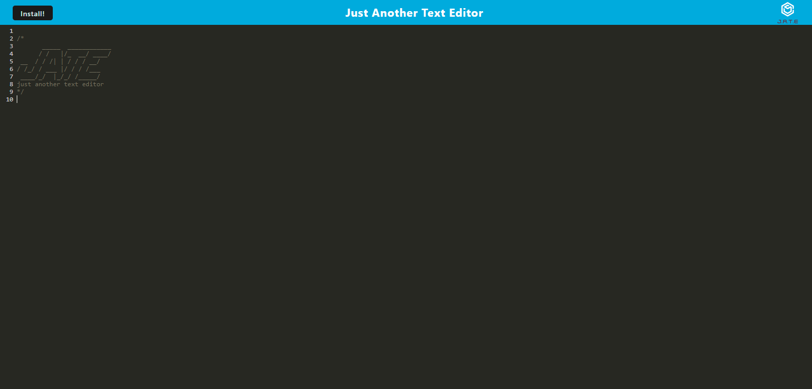

# JATE-Text-Editor

## Table of Contents
  
  - [Description](#description)
  - [Development](#development)
  - [Installation](#installation)
  - [Technology](#technology)
  - [Questions](#questions)

  ---

## Description

  J.A.T.E is a simple text editor powered by CodeMirror. The app meets PWA criteria, enabling Users to install it on their desktop or smartphone and even work offline. 

  The app is deployed live with Heroku and can be found here:
  https://jate-text-editor-pwa.herokuapp.com/

  

 ## Development
  
  My objective with this project was to take an already function Web App and turn it into a Progressive Web App. This was achieved by implementing the following strategies:
  
   - Pages and Assets are cached via a Service Worker, enabling offline functionality.
   - User input is stored with IndexDB once the editor has lost focus, providing data persistence after exiting the browser.
   - Webpack was used to inject a Manifest file which provides parameters for local installation.

 ## Installation

 Users can install J.A.T.E on their devices by either clicking the "install" button in the header, or by the install prompt in the Address bar. 

 ## Technology
 - Node.js
 - Express.js
 - Indexeddb
 - Webpack
 - CodeMirror
 - Heroku
  

  ## Questions
  Have any questions? Feel free to check out my github or send me an Email!

  https://github.com/jacobmabob  
  thejacobmccarthy@gmail.com